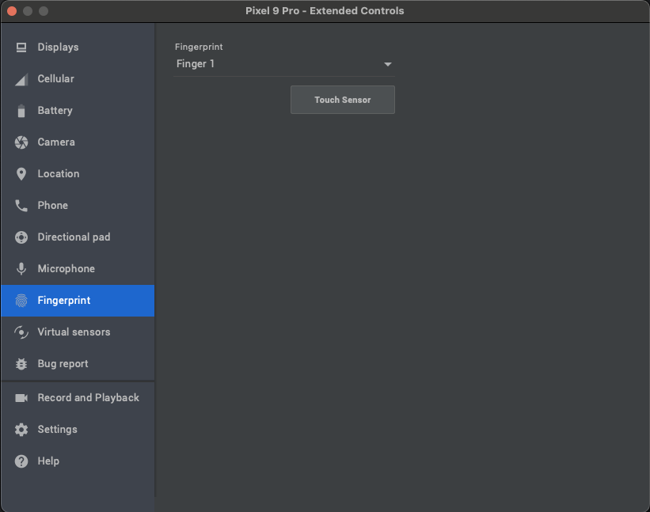

# Mock MWA Wallet

A mock Solana Mobile Wallet app for testing Mobile Wallet Adapter (MWA) integration in your applications.

## ⚠️ Warning

**This is a testing wallet only. Do not use with real funds or in production environments.**

## Features

- Mobile Wallet Adapter support for `authorize`, `signIn`, `signAndSendTransactions`, and `signMessage`.
- Apple pay-like transaction signing (Bottom sheet approval, no app switch)
- Biometric authentication
- Configurable Ed25519 private key loading for testing the wallet

## Installation

To build this app, install the latest version of [Android Studio](https://developer.android.com/studio/install).

1. Clone the Mock MWA Wallet Repo

```bash
git clone https://github.com/solana-mobile/mock-mwa-wallet.git
```

2. Open the project on Android Studio > Open > `mock-mwa-wallet/build.gradle`

3. **Optional:** Import an existing private key in `local.properties` to use in the wallet. See [Import a private key](#import-a-private-key).

4. Build the app and install on any Android device or emulator.

## Testing Your App

1. Install Mock MWA Wallet on an Android device or emulator
2. In the wallet, press the `Authenticate` button to enable wallet signing for 15 minutes.
3. In your app, install the MWA Client SDK and invoke the MWA `authorize` method.
4. Once invoked, Mock MWA Wallet will be discovered as a compatible wallet option.

## Usage guide

### Import a private key

By default, Mock MWA Wallet will generate a random keypair for usage when it is initialized. 

In `mock-mwa-wallet/local.properties`, you can configure the wallet to initialize with a given Ed25519 private key.

1. In `local.properties` add a base64 encoded private key string:

```
privateKey=<BASE64_ENCODED_PRIVATE_KEY_STRING> 
```

This should be a private key that is strictly used for development purposes.

2. Rebuild and install the app.

3. Now, when you connect to the wallet, it will authorize and sign transactions with the imported private key.

### Authenticating on an emulator

You can add Device Authentication on an emulator, just like on a physical device. 
- On your emulator go to the Settings app 
- Search for `Fingerprint` or `Pin Code` settings page
- Follow the standard setup instructions. 
- If using fingerprint, your emulator settings (through Android Studio) can simulate a fingerprint.


