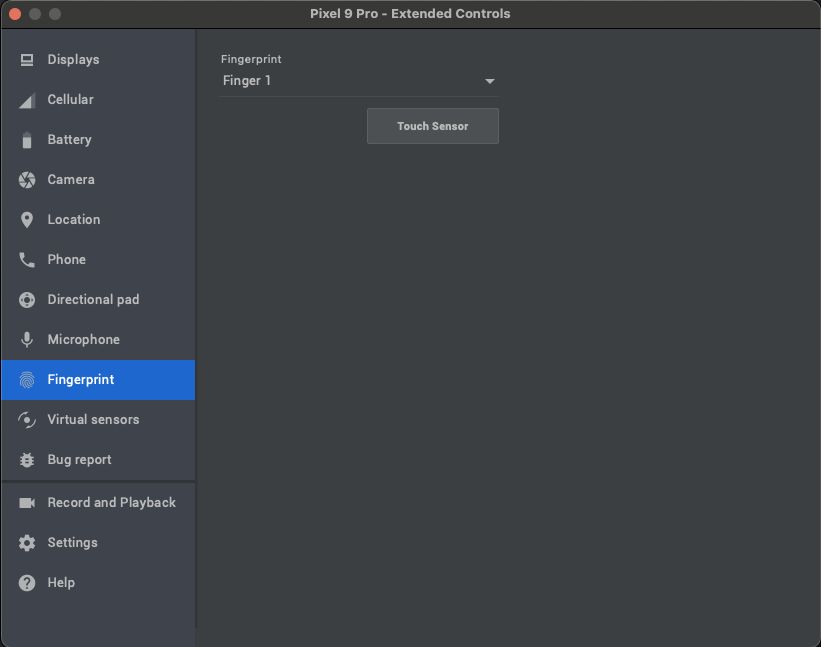

# Mock MWA Wallet

A mock Solana Mobile Wallet app for testing Mobile Wallet Adapter (MWA) integration in your applications.

## ⚠️ Warning

**This is a testing wallet only. Do not use with real funds or in production environments.**

## Features

- Mobile Wallet Adapter support for `authorize`, `signIn`, `signAndSendTransactions`, and `signMessage`.
- Apple pay-like transaction signing (Bottom sheet approval, no app switch)
- Biometric authentication
- Seed phrase loading and derivation for testing the wallet

## Installation

To build this app, install the latest version of [Android Studio](https://developer.android.com/studio/install).

1. Clone the Mock MWA Wallet Repo

```bash
git clone https://github.com/solana-mobile/mock-mwa-wallet.git
```

2. Open the project on Android Studio > Open > `mock-mwa-wallet/build.gradle`

3. **Optional:** Create a development `local.properties` with a wallet name:

```bash
./gradlew setup
```

This creates `local.properties` only if it does not already exist. The generated wallet name is `mock.mwa`.

4. **Optional:** Configure an existing seed phrase in `local.properties` to use in the wallet. See [Import a seed phrase](#import-a-seed-phrase).

5. Build the app and install on any Android device or emulator.

## Testing Your App

1. Install Mock MWA Wallet on an Android device or emulator
2. In the wallet, press the `Authenticate` button to enable wallet signing for 15 minutes.
3. In your app, install the [MWA Client SDK](https://docs.solanamobile.com/mobile-wallet-adapter/mobile-apps) and invoke the MWA `authorize` method.
4. Once invoked, Mock MWA Wallet will be discovered as a compatible wallet option.

## Usage guide

### Import a seed phrase

In `mock-mwa-wallet/local.properties`, you can configure the wallet to initialize with a seed phrase.

1. In `local.properties` add a 12-word or 24-word seed phrase:

```
seedPhrase=<SEED_PHRASE>
```

The wallet stores the seed phrase in app-private storage on first launch, then derives Solana accounts at `m/44'/501'/0'`, `m/44'/501'/1'`, and so on.

2. Rebuild and install the app.

3. Now, when you connect to the wallet, it will authorize and sign transactions with the first keypair derived from the imported seed phrase. The home screen shows derived wallets, a button to derive the next wallet, and a button to reveal or copy the stored seed phrase.

If no `seedPhrase` is configured in `local.properties`, the app generates a development seed phrase in memory. Press `Import seed phrase` to store it, then press `Show seed phrase` to reveal or copy it. Until wallet selection is added, the selected wallet is always `m/44'/501'/0'`.

### Set the wallet name

By default, Mock MWA Wallet presents itself as `mwallet`.

In `mock-mwa-wallet/local.properties`, you can configure the wallet name:

```
walletName=some.skr
```

Rebuild and install the app for the new wallet name to take effect.

### Authenticating on an emulator

You can add Device Authentication on an emulator, just like on a physical device. 
- On your emulator go to the Settings app 
- Search for `Fingerprint` or `Pin Code` settings page
- Follow the standard setup instructions. 
- If using fingerprint, your emulator settings (through Android Studio) can simulate a fingerprint.


